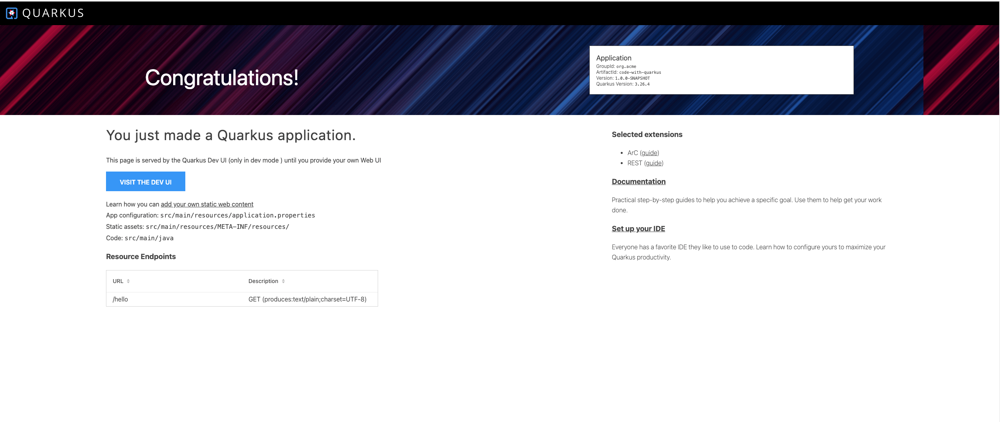

[Back](../index.md)

## Get Started

<hr>


### Step 1: Install via Command Line Interface
- macOS
  ```shell
  curl -Ls https://sh.jbang.dev | bash -s - trust add https://repo1.maven.org/maven2/io/quarkus/quarkus-cli/
  curl -Ls https://sh.jbang.dev | bash -s - app install --fresh --force quarkus@quarkusio
  ```

- result
  ```
  Downloading JBang ...
  Installing JBang...
  [jbang] Trusting permanently: [https://repo1.maven.org/maven2/io/quarkus/quarkus-cli/]
  [jbang] Command installed: quarkus
  [jbang] JBang environment setup completed...
  Please start a new Shell for changes to take effect
  ```

&nbsp;

### Step 2: Create the Getting Started Application
- Run this script in your CLI:
  ```shell
  quarkus create && cd code-with-quarkus
  ```

- result
  ```
  Creating an app (default project type, see --help).
  Looking for the newly published extensions in registry.quarkus.io
  -----------

  applying codestarts...
  📚 java
  🔨 maven
  📦 quarkus
  📝 config-properties
  🔧 tooling-dockerfiles
  🔧 tooling-maven-wrapper
  🚀 rest-codestart

  -----------
  [SUCCESS] ✅  quarkus project has been successfully generated in:
  --> /Users/elliotgu/code-with-quarkus
  -----------
  Navigate into this directory and get started: quarkus dev
  ```

&nbsp;

### Step 3: Run the Getting Started Application
- Run this script in your CLI:
  ```shell
  quarkus dev
  ```

  Your Quarkus app is now running at localhost:8080

  
